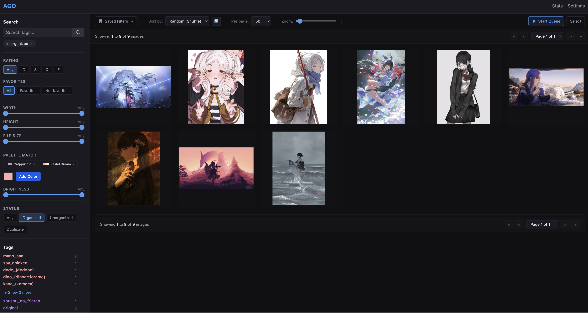
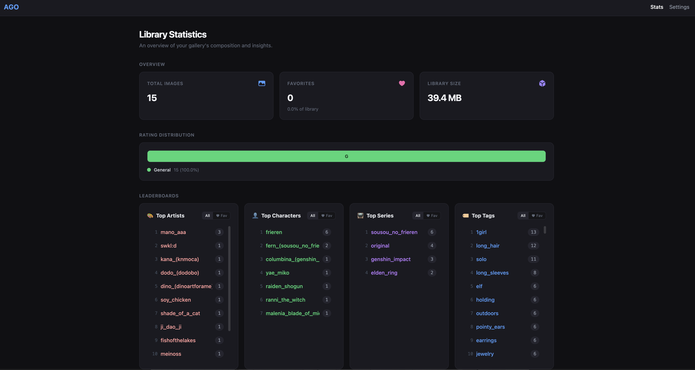

# Anime Gallery Organizer

AGO2 is a locally hosted anime gallery manager that helps you organize, search, and enrich your image collection. It features powerful integrations with Danbooru to automatically fetch high-quality tags, ratings, and metadata for your images.


*The main gallery view featuring advanced search, tags, and color palette filtering.*


*Comparing local files against high-quality Danbooru sources for easy replacement and metadata tagging.*


*A look at the built-in library statistics and data.*

## Features

- **Smart Organization**: Automatically detects duplicate images via hashing and helps keep your collection organized.
- **Danbooru Integration**: Automatically uploads image hashes/data to identify sources and fetch extensive metadata, tags, and ratings from Danbooru.
- **Advanced Search & Filtering**: Search by specific tags, dimensions, file size, rating, and even image brightness or dominant color palettes!
- **Color Extraction**: Automatically extracts dominant colors from your images, allowing you to search by hex codes or saved color palettes.
- **Favorites & Saved Filters**: Keep track of your favorite images and save complex search queries for quick access.
- **Library Statistics**: View detailed insights into your collection, including total images, duplicates, disk space usage, and rating distributions.

## Prerequisites

To run this project locally, you will need:
- [Go](https://go.dev/doc/install) (1.20+ recommended)
- [Node.js](https://nodejs.org/) (v18+ recommended) and npm
- A [Danbooru](https://danbooru.donmai.us/) account (optional, but highly recommended for metadata fetching)

## Setup

1. **Clone the repository**
   ```bash
   git clone https://github.com/yourusername/AGO2.git
   cd AGO2
   ```

2. **Backend Setup (Go)**
   The backend uses Go and SQLite (which doesn't require a separate database server).
   From the root of the project, install dependencies and run the server:
   ```bash
   go mod download
   go run main.go
   ```
   *(Note: The application will automatically create `gallery.db` and the necessary directories on first run).*

3. **Frontend Setup (React + Vite)**
   Navigate to the `ui` folder, install dependencies, and start the development server:
   ```bash
   cd ui
   npm install
   npm run dev
   ```

4. **Open the App**
   Visit the URL provided by Vite (usually `http://localhost:5173`) in your browser to start using AGO2!

5. **Environment Variables & Credentials**
   You can provide your Danbooru API credentials in two ways:
   - **Frontend**: Once the app is running, navigate to the Settings page in the UI and enter your Username and API Key.
   - **Environment File**: Alternatively, copy the `.env.example` file to `.env` and fill in your `USERNAME` and `DANBOORU_KEY`.

## Usage

- **Adding Images**: Ensure that all the images you want to manage are placed directly inside the `./Gallery` folder in the root directory. It updates once you run "sync" in the settings.

## License

This project is licensed under the [MIT License](LICENSE).

## Credits

A special thanks to the incredibly talented artists whose work is featured in the screenshots above:
- mano_aaa
- swkl:d
- kana_(knmoca)
- dodo_(dodobo)
- dino_(dinoartforame)
- soy_chicken
- shade_of_a_cat
- ji_dao_ji
- fishofthelakes
- meinoss
- world_(1257843324)
- quasarcake
- shiej007
